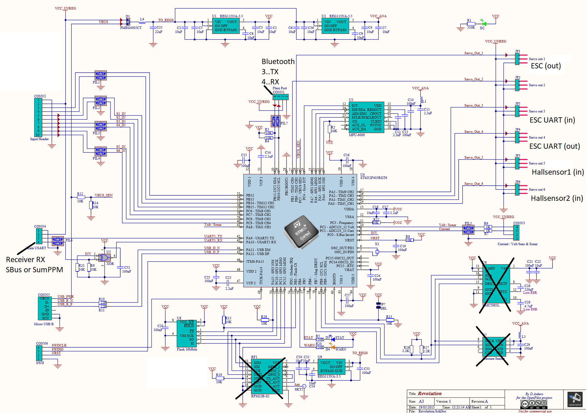

# CC3D-CableCam-Controller
A STM32 based CableCam Controller
MCU used is [STM32F405RG](http://www.st.com/en/microcontrollers/stm32f405rg.html)
Board used: Any CC3D Revolution or clone, e.g. F4 Advanced Flight Controller by Bob Forooghi [example board](http://www.getfpv.com/f4-advanced-flight-controller.html)

## Goals
The most simple way to control a cablecam is by connecting the RC receiver to the motor controller (=ESC, speed controller) and control it like a RC car.
But this has multiple limitations the CableCam Controller tries to solve:
1. The CableCam might crash into the start- or endpoint by accident. Would be much nicer if the CableCam calculates the required braking distance constantly and does engage the brake automatically. This way it stops automatically no matter of the user input.
1. A smooth acceleration/deceleration makes the videos look better. Even when the stick is pushed forward at once, the CableCam should accelerate slowly instead of the wheel slipping over the rope.
1. A speed limiter to protect the CableCam from going too fast and for constant speed travels during filming.
1. Direct positional control. Normally the stick controls the thrust. But the thrust might mean different things, e.g. a thrust of zero could make the CableCam accelerate downhill. The stick of the RC sender should rather control the speed - stick in neutral means the CableCam should stop.
1. Preprogram movement patterns and the Cablecam repeats them on request.

To achieve that the CableCam controller sits between the receiver and the motor controller and acts as a governour of the receiver input. If for example the user did push the stick forward from neutral to max within a second, the CableCam Controller rather increases the stick position slowly. For speed and positional input the controller is connected to two hall sensors on one of the running wheels.

## Getting started

### Hardware
Instead of using a custom build PCB the project is based on easy to get hardware but flashed with a new firmware. 
This PCB should be small, have an onboard power regulator suited for RC-receiver typical voltages, servo connectors for power in and ESC output. It should also be based on a STM32F4 chip for easier flashing of the firmware - no bootloader needed - and include the needed hardware inverter for SBus signals. The Flight Controllers developed for Copters are an obvious choice.
In particular the [CC3D Revolution board](http://opwiki.readthedocs.io/en/latest/user_manual/revo/revo.html) is a perfect match. The only drawback of the CC3D Revo is that it contains additional hardware like a magnetometer, a barometric height sensor and an expensive RF link - nothing useful for a CableCam. But luckily there a clones of this board without these components, making the board cheaper as well.

_Note: The STM32F4 allows very flexible remapping of the pins to different functions, hence what is supposed to be used as output in the CC3D Revo firmware is rather used as input with the CableCam Controller firmware._

### Flashing the firmware

### Initial Setup

### Use

## Detailed Usage

## Development

### Hardware Mapping

* Servo1: Servo Output to the ESC; Connect the ESC to it in order to feed it with valid PPM servo signals; PB0 -> TIM3_CH3
* Servo2: Servo Output PB1 -> TIM3_CH4 (not used yet)
* Servo3: ESC Output via UART; PA3 -> USART2_RX
* Servo4: ESC Output via UART; PA2 -> USART2_TX
* Servo5&6: 32Bit Quadruple Encoder used for Hall Sensor input; PA0, PA1 -> TIM5_CH1, TIM5_CH2
* LED Status: PB5 (Low = On)
* LED Warn: PB4 (Low = On)
* MainUSART: Receiver input; In SBus Mode: PA9, PA10 -> USART1_TX, USART1_RX; In SumPPM mode: PA10 -> TIM1_CH3

* SPI1: PA4, PA5, PA6, PA7 for MPU-6000 IMU
* SPI3: PA15, PC10, PC11, PC12 for Flash 16MBit and optional RF Module (not used)